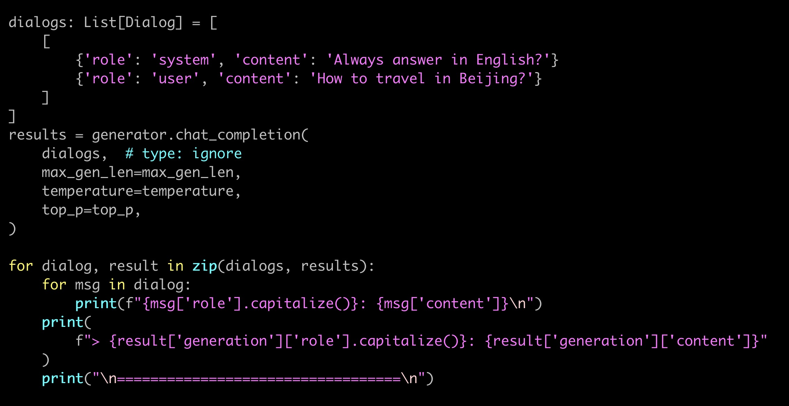

# 我的LLM学习心得

## 一、本地部署llama
本章主要参考[https://github.com/facebookresearch/llama.git](https://github.com/facebookresearch/llama.git)
### 1、申请llama许可
申请网站（需要科学上网): [https://ai.meta.com/resources/models-and-libraries/llama-downloads/](https://ai.meta.com/resources/models-and-libraries/llama-downloads/)

勾选 Llama 2 & Llama Chat 和底部 I accept the terms and conditions 点击 Accept and Continue  
一段时间后，邮箱会收到一封邮件，以 `https://download.llamameta.net/*` 开头的链接就是下载权重参数文件时需要验证的信息。

### 2、下载权重参数文件
首先配置虚拟环境
```
conda create -n llama python=3.10
conda activate llama
```
然后克隆llama的git仓库并安装依赖
```
git clone https://github.com/facebookresearch/llama.git 
cd llama
pip install -e . -i https://pypi.tuna.tsinghua.edu.cn/simple
```
下载权重参数
```commandline
bash download.sh
```
输入第一步所得URL，然后询问下载哪种参数文件

这里可以选择7B，然后等待下载结束

参数文件保存路径为`./llama-2-7b/consolidated.00.pth`
### 3、运行模型
llama文件中提供了两个demo以供运行。一个是句子补全任务`example_text_completion.py`，一个是对话任务 `example_chat_completion.py`(需要看下载参数文件时选择的7B还是7B-chat)  
两个常用脚本
```commandline
torchrun --nproc_per_node 1 example_text_completion.py --ckpt_dir llama-2-7b/ --tokenizer_path tokenizer.model --max_seq_len 128 --max_batch_size 4
torchrun --nproc_per_node 1 example_chat_completion.py --ckpt_dir llama-2-7b-chat/ --tokenizer_path tokenizer.model --max_seq_len 512 --max_batch_size 4
```
想体验自己的文本输出，可以在`example_text_completion.py`里修改`prompts`变量。`prompts`是一个列表，里面是所有想要补全的文本。

或者修改`example_chat_completion.py`里的`dialogs`变量。按照openai`system`、`user`、`assistant`的标准格式改写即可


## 二、lit-llama微调大模型
本章主要参考[https://github.com/Lightning-AI/lit-llama](https://github.com/Lightning-AI/lit-llama)  
lit-llama暂时不支持多卡训练
### 1、本地部署lit-llama
首先创建虚拟环境
```
conda create -n litllama python=3.10
conda activate litllama
```
然后克隆lit-llama的git仓库并安装依赖
```
git clone https://github.com/Lightning-AI/lit-llama
cd lit-llama
pip install -r requirements.txt -i https://pypi.tuna.tsinghua.edu.cn/simple
```
然后把我们在第一章申请到的权重参数文件copy出来，到lit-llama目录下面，具体路径如下所示
```commandline
checkpoints/llama
├── 7B
│   ├── ...
│   └── consolidated.00.pth
├── 13B
│   ...
└── tokenizer.model
```
执行如下命令把权重参数文件转为lit-llama格式
```commandline
python scripts/convert_checkpoint.py --model_size 7B
```
然后执行如下命令体验lit-llama
```commandline
python generate.py --prompt "Hello, my name is"
```
这需要大概26GM的GPU显存，我们的gpu2单卡显存24GB，爆内存了，转用低精度
```commandline
python generate.py --quantize llm.int8 --prompt "Hello, my name is"
```
运行成功

### 2、微调
首先准备数据集。数据集选用[Alpaca](https://github.com/tatsu-lab/stanford_alpaca)，执行下面命令会自动下载
```commandline
python scripts/prepare_alpaca.py
```
然后开始微调
```commandline
python finetune/lora.py
```
因为这个仓库下的代码暂不支持多卡训练，一张P40训练37500个epoch一共用了46小时，lora参数保存路径为`./out/lora/alpaca/lit-llama-lora-finetuned.pth`  
然后执行下面么命令观察微调效果
```commandline
python generate/lora.py --prompt "Recommend a movie to watch on the weekend."
```
期待得到结果
```commandline
I would recommend the movie The Martian (2015). It is a sci-fi movie starring Matt Damon that follows the story of...
```
但是在执行时显存又爆了。并且执行lora时不支持降低精度，在第一节中使用的方法不奏效了。  
于是我想在第一步预训练的参数就降为`4bit`，执行如下命令
```commandline
python quantize/gptq.py --output_path checkpoints/lit-llama/7B/llama-gptq.4bit.pth --dtype bfloat16 --quantize gptq.int4
```
但是在拉取`hugging face`的过程中失败，后作罢

## 三、LLaMA-Factory仓库
本章主要参考[https://github.com/hiyouga/LLaMA-Factory](https://github.com/hiyouga/LLaMA-Factory)  
LLaMA-Factory提供图形化微调，b站视频链接: [从零到一微调大语言模型ChatGLM,LLaMA](https://www.bilibili.com/video/BV1oH4y1R7xi)
LLaMA-Factory支持多卡训练  
首先创建虚拟环境
```commandline
conda create -n llama_factory python=3.10
conda activate llama_factory
```
然后克隆LLaMA-Factory的git仓库并安装依赖
```commandline
git clone https://github.com/hiyouga/LLaMA-Factory.git
cd LLaMA-Factory
pip install -r requirements.txt -i https://pypi.tuna.tsinghua.edu.cn/simple
```
如果是单卡训练，执行如下命令
```commandline
CUDA_VISIBLE_DEVICES=0 python src/train_bash.py \
    --stage sft \
    --model_name_or_path path_to_llama_model \
    --do_train \
    --dataset alpaca_gpt4_en \
    --template default \
    --finetuning_type lora \
    --lora_target q_proj,v_proj \
    --output_dir path_to_sft_checkpoint \
    --overwrite_cache \
    --per_device_train_batch_size 4 \
    --gradient_accumulation_steps 4 \
    --lr_scheduler_type cosine \
    --logging_steps 10 \
    --save_steps 1000 \
    --learning_rate 5e-5 \
    --num_train_epochs 3.0 \
    --plot_loss \
    --fp16
```
如果是多卡训练，执行如下命令
```commandline
deepspeed --num_gpus 8 --master_port=9901 src/train_bash.py \
    --deepspeed ds_config.json \
    --stage sft \
    --model_name_or_path path_to_llama_model \
    --do_train \
    --dataset alpaca_gpt4_en \
    --template default \
    --finetuning_type lora \
    --lora_target q_proj,v_proj \
    --output_dir path_to_sft_checkpoint \
    --overwrite_cache \
    --per_device_train_batch_size 4 \
    --gradient_accumulation_steps 4 \
    --lr_scheduler_type cosine \
    --logging_steps 10 \
    --save_steps 1000 \
    --learning_rate 5e-5 \
    --num_train_epochs 3.0 \
    --plot_loss \
    --fp16
```
我在这里卡住了，因为使用`deepspeed`需要`CUDA`安装过`Toolkit`，我们的`gpu2`没有，并且安装需要`sudo`权限，所以我就没有再继续使用LLaMA-Factory

## (持续更新中......)